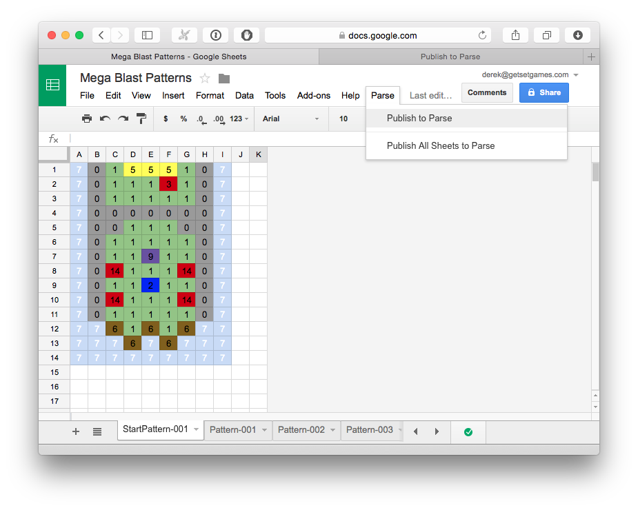

# SheetsToParse

Scripts that allow publishing Google Sheets to Parse as 2D arrays. This can be used to edit tile-based levels in games that are downloaded at runtime.

## Setup

### 1. Setup Parse

Add the contents of [parse/main.js](parse/main.js) to your Cloud Code on Parse. Refer to [Parse's Cloud Code documentation](https://parse.com/docs/cloud_code_guide) for how to do that.

This adds a function called *publishPattern* to your cloud code. The function will be used by Google Sheets to publish patterns or update them if a pattern with the same name already exists.

### 2. Setup Google Sheets

#### 2.1 Add the Script

Add the contents of [sheets/Code.gs](sheets/Code.gs) to your Google Sheet by selecting the *Tools > Script editor...* menu option.

#### 2.2 Fill in your Parse App Id and REST API Key

At the top of [sheets/Code.gs](sheets/Code.gs) you'll see two variables called *parseAppId* and *parseRestAPIKey*. Replace their values with the ones from your Parse app.

#### 2.3 Refresh Your Sheet

When you refresh your sheet, you will see a Parse menu item added to the end of the menu, like so:

## Usage

### Publish to Parse

This menu item publishes the current Sheet to Parse. Sheets will be published to a class in Parse that is named after the Google Spreadsheet (unless you're using the patternSuffixMap in [sheets/Code.gs](sheets/Code.gs) - see below). Sheets are published as a row that contains the following fields:

- *name* : the name of the pattern as defined by the name of the Sheet in Google Sheets
- *pattern* : a 2D array containing the contents of the Sheet
- *rows* : the number of rows in the *pattern* field
- *columns* : the number of columns in the *pattern* field

If a pattern with the same name already exists in Parse, it will be updated.

### Publish All Sheets to Parse

This menu item publishes all Sheets in the Spreadsheet to Parse.

Published patterns will appear in Parse like so:

## Options

[sheets/Code.gs](sheets/Code.gs) features a few options that you may find useful, all of which can be controlled by changing variables at the top of the script:

### Reverse Rows

You may find it convenient for the rows of the pattern to be reversed. Just set the *reverseRows* variable to true to do this.

### Convert Values

You can have the script convert all values in the table to any other values. For example, you could map numbers to class names which your app then instances by name.

To do this, set the *convertValues* variable to true and add key-value pairs to the *valueMap* variable.

### Change Parse Class Based on Contents

You might need to have your Sheets publish to different classes in Parse based on their contents. For example, you might have special patterns that contain a player-spawn position or a level-end position and you might need these patterns to be saved to separate classes in Parse.

You can do this by adding key-value pairs to the variable called *patternSuffixMap*. Any patterns that contain the keys will have the corresponding value added as a suffix to the class name in Parse.
